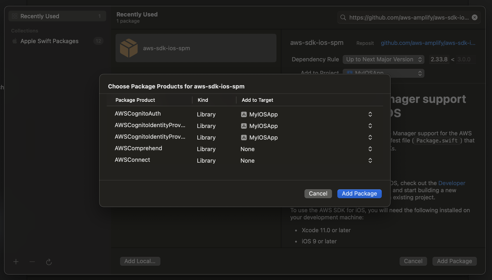

# Sample Flutter App for Integrating with AWS Cognito and implemnting Authentication

## Step-1: Set Up AWS Cognito User Pool and App Client ID
  - Log in to the AWS Management Console.
  - Navigate to Amazon Cognito and select "Manage User Pools."
  - Click "Create a user pool," name it, and follow the prompts to configure settings. 
  - Set up an App Client if you haven't already.
  - Make sure to note your Pool ID and App Client ID (without a client secret).

## Step 2: Integrate AWS SDK into Your iOS Project
  - Open your iOS project in Xcode. Use Swift Package Manager (SPM), CocoaPods, or Carthage to integrate the AWS SDK for iOS. 
  - For Siwft Package Manager, Add `https://github.com/aws-amplify/aws-sdk-ios-spm` as follows:
  - 
  - For CocoaPods, use the following in your Podfile:
```
pod 'AWSCognitoIdentityProvider'
pod 'AWSCognito'
```
  - Run pod install and open the .xcworkspace file.

## Step 3: Initialize Cognito
Update `MyIOSApp/Info.plist` and initialize your Cognito user pool with your Pool ID and App Client ID:
```
<?xml version="1.0" encoding="UTF-8"?>
<!DOCTYPE plist PUBLIC "-//Apple//DTD PLIST 1.0//EN" "http://www.apple.com/DTDs/PropertyList-1.0.dtd">
<plist version="1.0">
<dict>
	<key>ClientID</key>
    <string>{YOUR CLIENT ID}</string>
	<key>UserPoolID</key>
    <string>{YOUR USER POOL ID}</string>
</dict>
</plist>
```  

## Step 4: Integrate with AWS Cognito APIs
See `MyIOSApp/CognitoManager.swift` for an example of integrating with AWS Cognito, e.g.,

```
import Foundation
import os
import AWSCognitoIdentityProvider

class CognitoManager: ObservableObject {
    var userPool: AWSCognitoIdentityUserPool?

    init() {
        let serviceConfiguration = AWSServiceConfiguration(region: .USWest2, credentialsProvider: nil)
        let userPoolID = Bundle.main.object(forInfoDictionaryKey: "UserPoolID") as! String
        let clientID = Bundle.main.object(forInfoDictionaryKey: "ClientID") as! String
        let userPoolConfiguration = AWSCognitoIdentityUserPoolConfiguration(clientId: clientID, clientSecret: nil, poolId: userPoolID)
        AWSCognitoIdentityUserPool.register(with: serviceConfiguration, userPoolConfiguration: userPoolConfiguration, forKey: "UserPool")
        self.userPool = AWSCognitoIdentityUserPool(forKey: "UserPool")
    }

    func signUp(username: String, password: String, email: String, 
                completion: @escaping (Result<Bool, AuthError>) -> Void) {
        let emailAttribute = AWSCognitoIdentityUserAttributeType(name: "email", value: email)
        userPool?.signUp(username, password: password, userAttributes: [emailAttribute], validationData: nil).continueWith { (task) -> AnyObject? in
            DispatchQueue.main.async {
                if let error = task.error {
                    completion(.failure(AuthError.error(error as NSError)))
                } else {
                    completion(.success(true))
                }
            }
            return nil
        }
    }

    func confirmSignUp(username: String, confirmationCode: String,
                       completion: @escaping (Result<Bool, AuthError>) -> Void) {
        let user = self.userPool?.getUser(username)
        user?.confirmSignUp(confirmationCode).continueWith { (task) -> AnyObject? in
            DispatchQueue.main.async {
                if let error = task.error {
                    completion(.failure(AuthError.error(error as NSError)))
                } else {
                    completion(.success(true))
                }
            }
            return nil
        }
    }

    func signIn(username: String, password: String,
                completion: @escaping (Result<User, AuthError>) -> Void) {
        let user = self.userPool?.getUser(username)

        user?.getSession(username, password: password, validationData: nil).continueWith { (task) -> AnyObject? in
            DispatchQueue.main.async {
                if let error = task.error {
                    completion(.failure(AuthError.error(error as NSError)))
                } else {
                    completion(.success(
                        User(username: username, claims:
                                (task.result?.accessToken?.tokenClaims ??
                                         task.result?.idToken?.tokenClaims)!)))
                }
            }
            return nil
        }
    }
}
```  

## Step 4: Implementing UI
See `MyIOSApp/SignUpView.swift` for a sample UI to implement sign up or sign in functionality, e.g.,
```
import SwiftUI

struct SignUpView: View {
    @EnvironmentObject var cognitoManager: CognitoManager
    @EnvironmentObject var tabSelection: TabSelection

    @State private var username = ""
    @State private var password = ""
    @State private var email = ""
    @State private var errorMessage = ""

    var body: some View {
        VStack {
            TextField("Username", text: $username)
                .textFieldStyle(RoundedBorderTextFieldStyle())
            SecureField("Password", text: $password)
                .textFieldStyle(RoundedBorderTextFieldStyle())
            TextField("Email", text: $email)
                .textFieldStyle(RoundedBorderTextFieldStyle())
            Button("Sign Up") {
                cognitoManager.signUp(username: username, password: password, email: email) { result in
                    switch result {
                    case .success(_):
                        tabSelection.selectedTab = 1
                    case .failure(let error):
                        self.errorMessage = error.toString()
                    }
                }
            }
            if (errorMessage != "") {
                Label(
                    title: { Text(errorMessage).foregroundColor(.red) },
                    icon: { Image(systemName: "exclamationmark.triangle.fill").foregroundColor(.red) }
                )
            }
        }.padding()
    }
}
```

## Resources
- [AWS Cognito](https://aws.amazon.com/cognito/)
