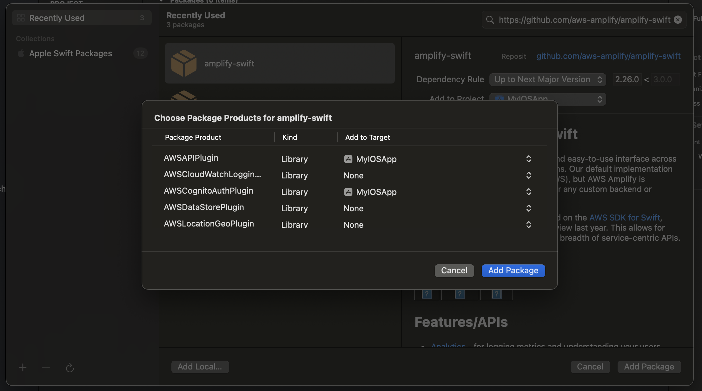

# Sample IOS App for Integrating with AWS Cognito using AWS Amplify and implementing basic Authentication Functionality.

## Prerequisite
  - Install Android Studio from https://developer.android.com/studio/install
  - Install Flutter from https://docs.flutter.dev/get-started/install/macos/mobile-android?tab=download
  - Accept Licences using `flutter doctor --android-licenses`.
  - Verify Flutter Installation using `flutter doctor -v`.

## Step-1: Set Up AWS Cognito User Pool and App Client ID
  - Log in to the AWS Management Console.
  - Navigate to Amazon Cognito and select "Manage User Pools."
  - Click "Create a user pool," name it, and follow the prompts to configure settings. 
  - Set up an App Client if you haven't already.
  - Make sure to note your Pool ID and App Client ID (without a client secret).

## Step 2: Set Up AWS Amplify in Your iOS Project
  - Install the AWS Amplify CLI if you haven't already: `npm install -g @aws-amplify/cli`.
  - Initialize Amplify in your project directory: `amplify init`
  - Add authentication to your Amplify project: ``amplify add auth``
  - Push the changes to AWS: `amplify push`

## Step 3: Install AWS Amplify Libraries in Your iOS App
  - If you are using Swift Package Manager then add Cognito package (https://github.com/aws-amplify/amplify-swift) as follows:
  
  - If you are using Podfile then add the following to your Podfile:
```
   pod 'Amplify'
   pod 'AmplifyPlugins/AWSCognitoAuthPlugin'
```
  - Run `pod install` in your terminal.

## Step 4: Integrate with AWS Cognito APIs
See `MyIOSApp/CognitoManager.swift` for an example of integrating with AWS Cognito, e.g.,

```
import Foundation
import os
import Amplify
import AWSCognitoAuthPlugin


class CognitoManager: ObservableObject {
    init() {
        do {
            try Amplify.add(plugin: AWSCognitoAuthPlugin())
            try Amplify.configure()
           } catch {
               print("Failed to initialize Amplify: \(error)")
           }
    }

    func signUp(username: String, password: String, email: String) async throws -> Bool {
        let userAttributes = [AuthUserAttribute(.email, value: email)]
        let options = AuthSignUpRequest.Options(userAttributes: userAttributes)

        do {
            let result = try await Amplify.Auth.signUp(username: username, password: password, options: options)
            return result.isSignUpComplete
        } catch let error {
            throw AuthError.error(error as NSError)
        }
    }

    func confirmSignUp(username: String, confirmationCode: String) async throws -> Bool {
        do {
            let result = try await Amplify.Auth.confirmSignUp(for: username, confirmationCode: confirmationCode)
            if result.isSignUpComplete {
                return true
            } else {
                throw AuthError.signinIncomplete
            }
        } catch let error {
            throw AuthError.error(error as NSError)
        }
    }

    func signIn(username: String, password: String) async throws -> User {
        do {
            let _ = await Amplify.Auth.signOut()

            let result = try await Amplify.Auth.signIn(username: username, password: password)
            if result.isSignedIn {
                var claims = [String: Any]()
                let attrs = try await Amplify.Auth.fetchUserAttributes()
                for attr in attrs {
                    claims["\(attr.key)"] = attr.value
                }
                return User(username: username, claims: claims)
            } else {
                throw AuthError.signinIncomplete
            }
        } catch let error {
            throw AuthError.error(error as NSError)
        }
    }
}
```  

## Step 4: Implementing UI
See `MyIOSApp/SignUpView.swift` for a sample UI to implement sign up or sign in functionality, e.g.,
```
import SwiftUI

struct SignUpView: View {
    @EnvironmentObject var cognitoManager: CognitoManager
    @EnvironmentObject var tabSelection: TabSelection

    @State private var username = ""
    @State private var password = ""
    @State private var email = ""
    @State private var errorMessage = ""

    var body: some View {
        VStack {
            TextField("Username", text: $username)
                .textFieldStyle(RoundedBorderTextFieldStyle())
            SecureField("Password", text: $password)
                .textFieldStyle(RoundedBorderTextFieldStyle())
            TextField("Email", text: $email)
                .textFieldStyle(RoundedBorderTextFieldStyle())
            Button("Sign Up") {
                Task {
                    do {
                        let _ = try await cognitoManager.signUp(username: username, password: password, email: email)
                        tabSelection.selectedTab = 1
                    } catch (let err as AuthError) {
                        self.errorMessage = err.toString()
                    } catch {
                        self.errorMessage = error.localizedDescription
                    }
                }
            }
            if (errorMessage != "") {
                Label(
                    title: { Text(errorMessage).foregroundColor(.red) },
                    icon: { Image(systemName: "exclamationmark.triangle.fill").foregroundColor(.red) }
                )
            }
        }.padding()
    }
}
```

## Resources
- [AWS Cognito](https://aws.amazon.com/cognito/)
